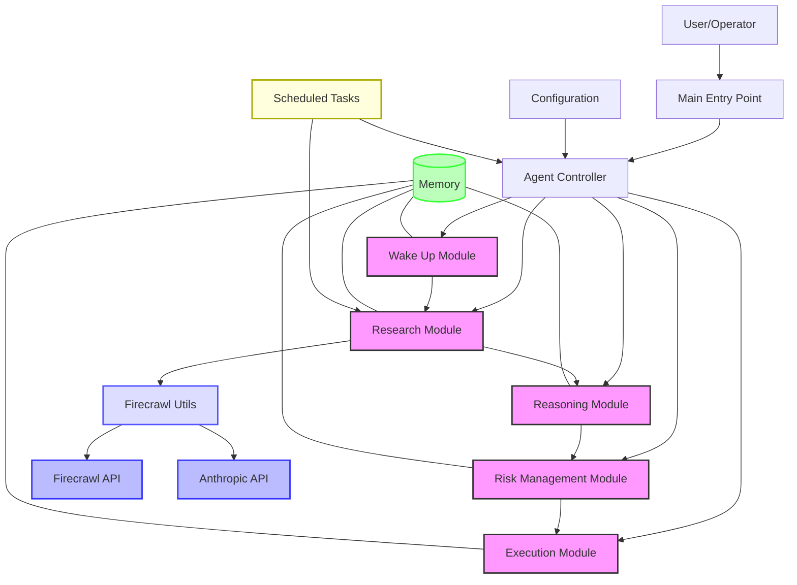

```mermaid
graph TD
    User[User/Operator] --> Main[Main Entry Point]
    Main --> Controller[Agent Controller]
    Config[Configuration] --> Controller
    
    %% Core Modules
    Controller --> Research[Research Module]
    Controller --> Reasoning[Reasoning Module]
    Controller --> RiskMgmt[Risk Management Module]
    Controller --> Execution[Execution Module]
    Controller --> WakeUp[Wake Up Module]
    
    %% Module Flow
    WakeUp --> Research
    Research --> Reasoning
    Reasoning --> RiskMgmt
    RiskMgmt --> Execution
    
    %% Firecrawl Integration
    Research --> FirecrawlUtils[Firecrawl Utils]
    FirecrawlUtils --> Firecrawl[Firecrawl API]
    FirecrawlUtils --> Anthropic[Anthropic API]
    
    %% Memory System
    Mem0[(Memory)] --- Research
    Mem0 --- Reasoning
    Mem0 --- RiskMgmt
    Mem0 --- Execution
    Mem0 --- WakeUp
    
    %% Scheduled Tasks
    ScheduledTasks[Scheduled Tasks] --> Controller
    ScheduledTasks --> Research
    
    %% Styling
    classDef module fill:#f9f,stroke:#333,stroke-width:2px;
    classDef external fill:#bbf,stroke:#33f,stroke-width:2px;
    classDef memory fill:#bfb,stroke:#3f3,stroke-width:2px;
    classDef api fill:#ddf,stroke:#55f,stroke-width:2px;
    classDef scheduled fill:#ffd,stroke:#aa0,stroke-width:2px;
    
    class Research,Reasoning,Execution,WakeUp,RiskMgmt module;
    class Firecrawl,Anthropic external;
    class Mem0 memory;
    class FirecrawlUtils api;
    class ScheduledTasks scheduled;
``` 