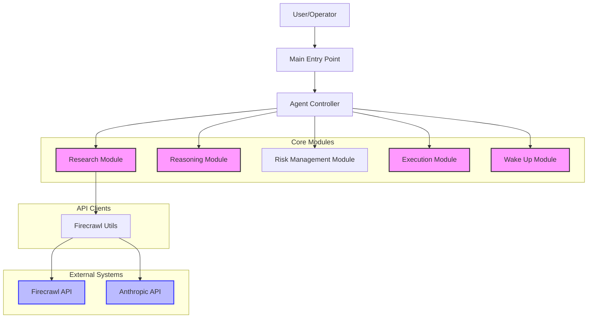

```mermaid
graph TD
    User[User/Operator] --> Main[Main Entry Point]
    Main --> Controller[Agent Controller]
    
    subgraph Modules["Core Modules"]
        Research[Research Module]
        Reasoning[Reasoning Module]
        RiskMgmt[Risk Management Module]
        Execution[Execution Module]
        WakeUp[Wake Up Module]
    end
    
    Controller --> Research
    Controller --> Reasoning
    Controller --> RiskMgmt
    Controller --> Execution
    Controller --> WakeUp
    
    subgraph APIClients["API Clients"]
        FirecrawlUtils[Firecrawl Utils]
    end
    
    subgraph ExternalSystems["External Systems"]
        Firecrawl[Firecrawl API]
        Anthropic[Anthropic API]
    end
    
    Research --> FirecrawlUtils
    FirecrawlUtils --> Firecrawl
    FirecrawlUtils --> Anthropic
    
    classDef module fill:#f9f,stroke:#333,stroke-width:2px;
    classDef external fill:#bbf,stroke:#33f,stroke-width:2px;
    
    class Research,Reasoning,Execution,WakeUp module;
    class Firecrawl,Anthropic external;
``` 