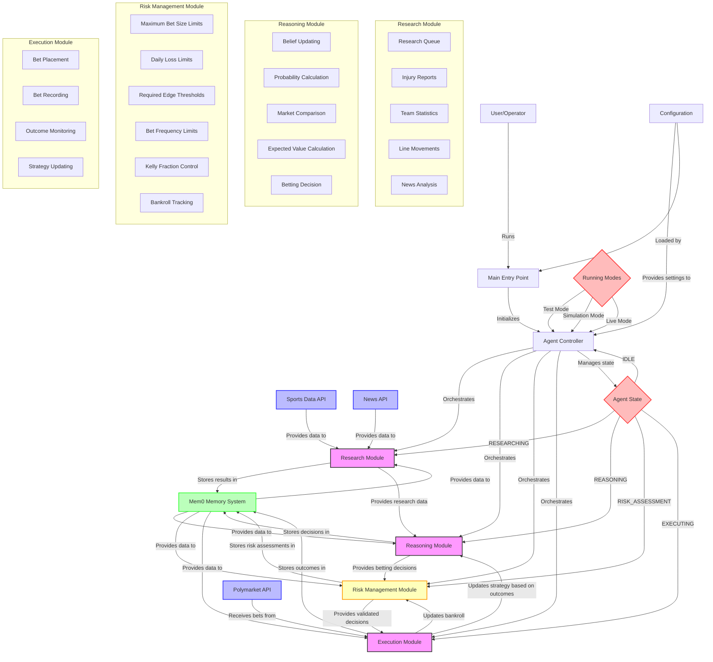

# NBA Betting Agent System Architecture

## System Workflow

1. **Initialization**:
   - User starts the agent via the main entry point
   - Configuration is loaded from settings
   - Agent Controller initializes with the specified mode (test, simulation, or live)
   - Memory client connects to Mem0

2. **Research Phase**:
   - Controller transitions to RESEARCHING state
   - Research Module gathers data from external APIs
   - Data includes team statistics, injury reports, betting odds, and news
   - Research results are stored in Mem0 memory

3. **Reasoning Phase**:
   - Controller transitions to REASONING state
   - Reasoning Module retrieves research data from memory
   - Beliefs are updated based on new information
   - Win probabilities are calculated and compared to market odds
   - Expected value is calculated for potential bets
   - Betting decisions are made and stored in memory

4. **Risk Assessment Phase**:
   - Controller transitions to RISK_ASSESSMENT state
   - Risk Management Module retrieves betting decisions from memory
   - Decisions are validated against risk parameters:
     - Maximum bet size limits
     - Daily loss limits
     - Required edge thresholds
     - Bet frequency limits
     - Kelly criterion adjustments
   - Validated decisions are stored in memory with risk assessment notes
   - Risk metrics are updated and stored

5. **Execution Phase**:
   - Controller transitions to EXECUTING state
   - Execution Module retrieves validated betting decisions from memory
   - In test mode: simulates bet placement
   - In live mode: places actual bets via Polymarket API
   - Bet details are recorded in memory
   - Bankroll is updated in the Risk Management Module

6. **Monitoring Phase**:
   - Execution Module monitors bet outcomes
   - Results are recorded and used to update strategies
   - Bankroll and risk metrics are updated based on outcomes
   - Performance metrics are calculated

7. **Idle Phase**:
   - Controller transitions to IDLE state
   - Waits for the next research interval
   - Cycle repeats

The system uses a state machine approach to manage the workflow, with the Agent Controller orchestrating the transitions between states and coordinating the modules. The Risk Management Module serves as a critical safety layer between the Reasoning and Execution modules, ensuring that all betting decisions adhere to predefined risk parameters before execution. 