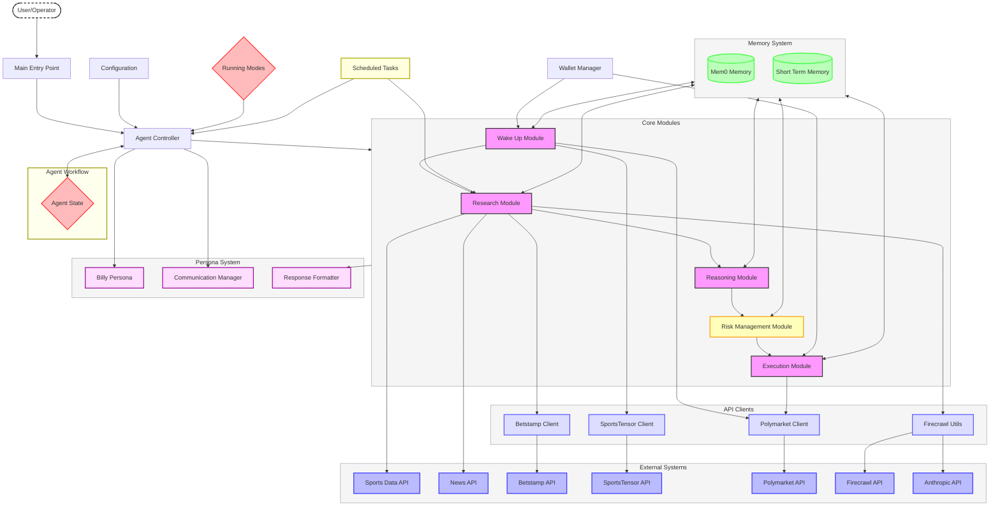

```mermaid
flowchart TD
    %% Main Components with clearer hierarchy
    User([User/Operator]) --> Main[Main Entry Point]
    Main --> Controller[Agent Controller]
    
    %% Configuration
    Config[Configuration] --> Controller
    
    %% Core Modules in a cleaner layout
    subgraph Modules["Core Modules"]
        direction TB
        Research[Research Module]
        Reasoning[Reasoning Module]
        RiskMgmt[Risk Management Module]
        Execution[Execution Module]
        WakeUp[Wake Up Module]
    end
    
    Controller --> Modules
    
    %% Agent State Management
    subgraph AgentWorkflow["Agent Workflow"]
        direction LR
        AgentState{Agent State}
    end
    
    Controller <--> AgentState
    
    %% API Clients with clearer connections
    subgraph APIClients["API Clients"]
        direction TB
        BetstampClient[Betstamp Client]
        SportsTensorClient[SportsTensor Client]
        PolymarketClient[Polymarket Client]
        FirecrawlUtils[Firecrawl Utils]
    end
    
    %% External Systems with clearer connections
    subgraph ExternalSystems["External Systems"]
        direction TB
        SportsAPI[Sports Data API]
        NewsAPI[News API]
        Betstamp[Betstamp API]
        SportsTensor[SportsTensor API]
        Polymarket[Polymarket API]
        Firecrawl[Firecrawl API]
        Anthropic[Anthropic API]
    end
    
    %% Memory System
    subgraph Memory["Memory System"]
        direction TB
        Mem0[(Mem0 Memory)]
        ShortTerm[(Short Term Memory)]
    end
    
    %% Persona System
    subgraph Persona["Persona System"]
        direction TB
        BillyPersona[Billy Persona]
        CommManager[Communication Manager]
        ResponseFormatter[Response Formatter]
    end
    
    %% Wallet System
    WalletManager[Wallet Manager]
    
    %% Scheduled Tasks
    ScheduledTasks[Scheduled Tasks]
    
    %% Running Modes
    RunModes{Running Modes}
    
    %% Core Module Connections (simplified)
    WakeUp --> Research
    Research --> Reasoning
    Reasoning --> RiskMgmt
    RiskMgmt --> Execution
    
    %% Controller connections
    Controller --> BillyPersona
    Controller --> CommManager
    RunModes --> Controller
    
    %% Memory connections (simplified)
    Memory <--> Research
    Memory <--> Reasoning
    Memory <--> RiskMgmt
    Memory <--> Execution
    Memory <--> WakeUp
    
    %% API Client connections (simplified)
    Research --> BetstampClient
    WakeUp --> SportsTensorClient
    WakeUp --> PolymarketClient
    Execution --> PolymarketClient
    Research --> FirecrawlUtils
    
    %% External System connections
    BetstampClient --> Betstamp
    SportsTensorClient --> SportsTensor
    PolymarketClient --> Polymarket
    FirecrawlUtils --> Firecrawl
    FirecrawlUtils --> Anthropic
    Research --> SportsAPI
    Research --> NewsAPI
    
    %% Scheduled Tasks connections
    ScheduledTasks --> Controller
    ScheduledTasks --> Research
    
    %% Wallet connections
    WalletManager --> WakeUp
    WalletManager --> Execution
    
    %% Persona Integration (simplified)
    Modules --> ResponseFormatter
    
    %% Styling
    classDef module fill:#f9f,stroke:#333,stroke-width:2px;
    classDef external fill:#bbf,stroke:#33f,stroke-width:2px;
    classDef memory fill:#bfb,stroke:#3f3,stroke-width:2px;
    classDef state fill:#fbb,stroke:#f33,stroke-width:2px;
    classDef risk fill:#ffb,stroke:#f90,stroke-width:2px;
    classDef api fill:#ddf,stroke:#55f,stroke-width:2px;
    classDef persona fill:#fdf,stroke:#909,stroke-width:2px;
    classDef workflow fill:#ffe,stroke:#990,stroke-width:2px;
    classDef group fill:#f5f5f5,stroke:#999,stroke-width:1px;
    classDef scheduled fill:#ffd,stroke:#aa0,stroke-width:2px;
    classDef user fill:#fff,stroke:#333,stroke-width:2px,stroke-dasharray: 5 5;
    
    class Research,Reasoning,Execution,WakeUp module;
    class RiskMgmt risk;
    class SportsAPI,NewsAPI,Betstamp,SportsTensor,Polymarket,Firecrawl,Anthropic external;
    class Mem0,ShortTerm memory;
    class AgentState,RunModes state;
    class BetstampClient,SportsTensorClient,PolymarketClient,FirecrawlUtils api;
    class BillyPersona,CommManager,ResponseFormatter persona;
    class AgentWorkflow workflow;
    class ScheduledTasks scheduled;
    class User user;
    class Modules,Persona,Memory,APIClients,ExternalSystems group;
``` 